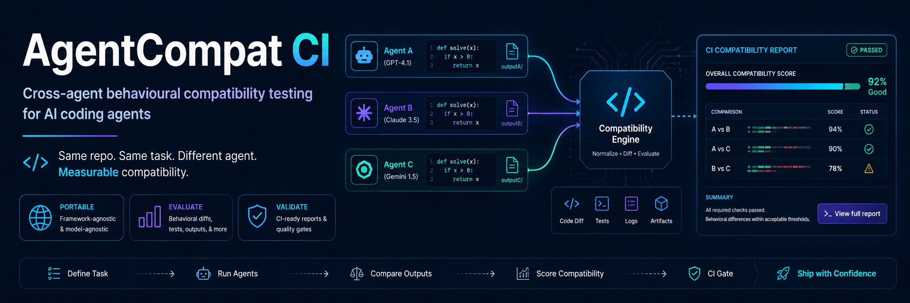
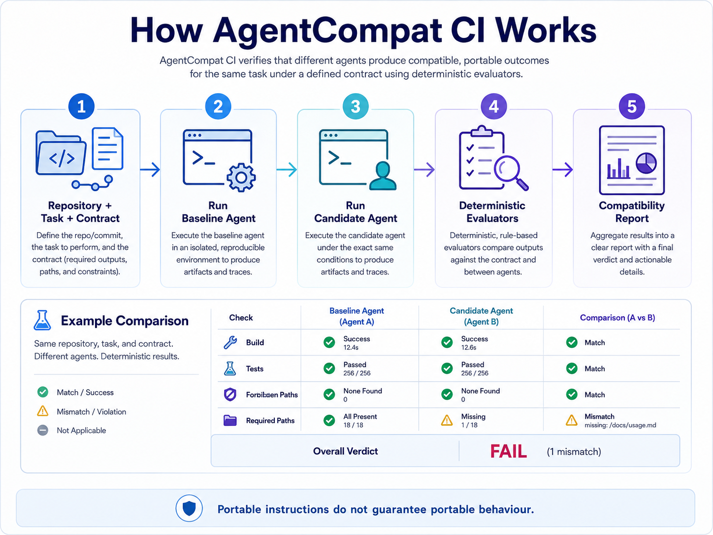
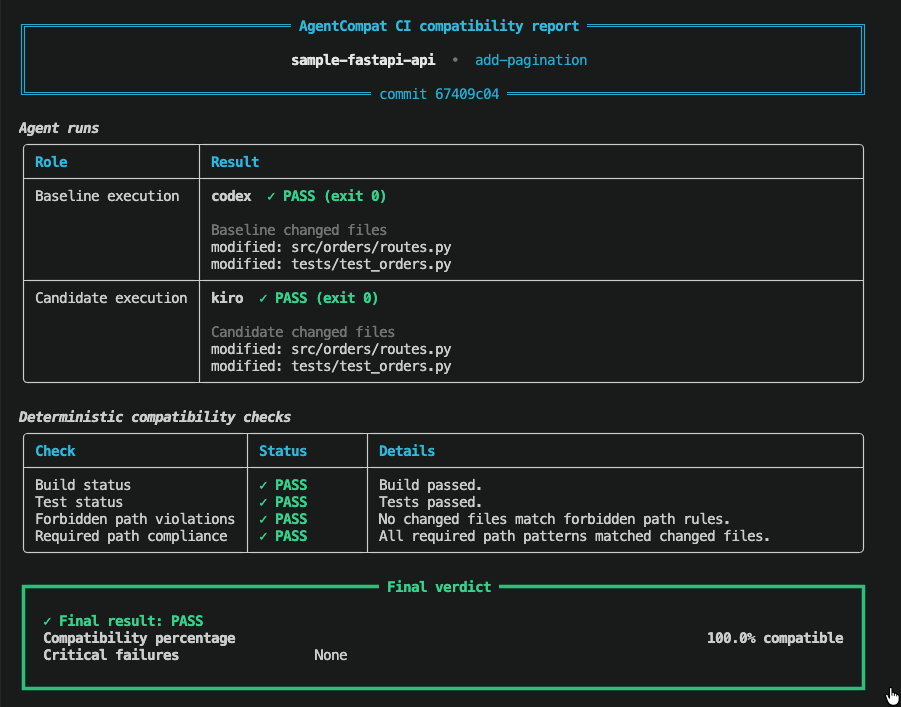

# AgentCompat CI

**Cross-agent behavioural compatibility testing for AI coding agents.**

> Same repository. Same task. Different agent. Measurable compatibility.


---

## Why AgentCompat CI?

AI coding-agent ecosystems are becoming increasingly portable.

Projects can now share instructions, tasks, skills, plugins, and development conventions across different coding agents.

But there is an important problem:

> **Portable instructions do not guarantee portable behaviour.**

The same repository, task, and engineering instructions may produce materially different outcomes when executed by different AI coding agents.

One agent may:

- pass all tests,
- preserve architecture boundaries,
- respect protected files,
- and make only the required changes.

Another agent, given exactly the same task, may:

- modify unrelated files,
- add unnecessary dependencies,
- ignore repository constraints,
- fail tests,
- or violate engineering policies.

AgentCompat CI makes those differences measurable.

---

## How It Works



AgentCompat executes the same engineering task against one baseline agent and one
candidate agent per invocation using isolated repository workspaces.

It then evaluates the resulting behaviour using deterministic checks.

```text
Repository
   +
Task
   +
Engineering Contract
        │
        ▼
┌─────────────────┐
│ Baseline Agent  │
└────────┬────────┘
         │
         │
┌────────▼────────┐
│ Candidate Agent │
└────────┬────────┘
         │
         ▼
┌────────────────────────┐
│ Deterministic Evaluator│
├────────────────────────┤
│ Tests                  │
│ Build                  │
│ Git diff               │
│ Forbidden paths        │
│ Required paths         │
│ Dependency changes     │
│ Repository policies    │
└───────────┬────────────┘
            │
            ▼
     Compatibility Report
```

---

## Core Idea

Traditional AI evaluation often asks:

> Which model generated the better answer?

AgentCompat asks a different question:

> **Does a candidate coding agent preserve the engineering behaviour required by this repository?**

The project focuses on behavioural compatibility rather than subjective code preference.

---

## Example

Suppose the same task is executed by Codex and Kiro.

This short example assumes a maintainer checkout containing the local orders API
fixture. Fresh-clone and custom-repository requirements are documented in the full
runbook linked below.

```bash
source .venv/bin/activate

PYTHONDONTWRITEBYTECODE=1 \
PYTEST_ADDOPTS="-p no:cacheprovider" \
agentcompat run \
  --repo fixtures/repos/orders-api \
  --baseline codex \
  --candidate kiro \
  --contract agent-contract.yaml \
  --task fixtures/tasks/add-pagination.yaml \
  --json-output results-codex-vs-kiro-run-01.json
```

See [Run a Codex-versus-Kiro Compatibility Test](#run-a-codex-versus-kiro-compatibility-test)
for prerequisites, authentication checks, expected run time, progress behaviour, and
troubleshooting.

### Sample result



The report presents both agent runs, their repository changes, deterministic checks,
compatibility percentage, critical failures, and the final verdict in one view. A
blocking contract violation always changes the final verdict to `FAIL`, regardless
of the aggregate compatibility percentage. Actual results depend on the agents and all
files they generate. Git-ignored artifacts remain visible in a separate report section
but do not consume the changed-file budget unless the contract opts in.

---

## What AgentCompat Evaluates

AgentCompat currently focuses on deterministic engineering signals.

### Functional Compatibility

- Build success
- Unit tests
- Integration tests
- Expected runtime behaviour

### Repository Compatibility

- Required files
- Forbidden files
- Maximum changed files
- Separate visibility for Git-ignored artifacts
- Optional changed-file exclusion globs
- Unexpected file creation
- Unexpected deletion

### Dependency Compatibility

- Trusted direct dependency additions and removals
- Forbidden direct dependencies
- Context-aware version and hashed source drift
- Exact lockfile additions, removals, and modifications
- Required resolver-input/lockfile co-updates

Python dependency observations currently support:

- PEP 508, static PEP 621, and ordered PEP 735 dependency groups
- validated Poetry and PDM declaration/source-policy subsets
- bounded UTF-8 pip requirements and constraint files, including recursive `-r`
  and `-c`, selected global index/link options, hashes, and supported editables
- `pylock.toml`, `poetry.lock`, `pdm.lock`, `Pipfile.lock`, and version-gated `uv.lock`

Known lock schema gates are pylock 1.0, Poetry 1.1/2.0/2.1, PDM 4.0.0 through
4.5.1, Pipfile spec 6, and uv lock version 1 revisions 0 through 3. Newer schemas are
rejected until their parsers are reviewed.

The scanner separates direct declarations from constraint-only and transitive locked
packages. It correlates version/source records by declaration scope, marker, and extras
context, and hashes source locators before reporting them. Resolver inputs include
declarations, constraints, dependency-group topology, integrity options, and repository
source policy.

The pip parser is deliberately fail-closed: unsupported pip-only forms or options cause
the configured dependency observation to fail instead of being silently ignored.
Poetry constraint strings receive deterministic syntax normalization, not full
Poetry-core semantic equivalence. Lockfile parsers accept only their documented,
version-gated subsets and configured lockfiles must exist.

Lockfile co-update evidence proves only that every configured lockfile's exact bytes
changed with a resolver input. It does not prove resolver freshness. AgentCompat does
not fetch or verify artifact contents, build a complete resolution graph, or evaluate
environment markers against concrete deployment targets. Appearance or disappearance
of a package in a supported lockfile is treated as version/source drift when those
strict rules are enabled.

### Policy Compatibility

- Protected paths
- Repository-specific rules
- Required commands
- Engineering constraints

The goal is to use deterministic evidence whenever possible.

AgentCompat does **not** rely on an LLM judge for its core PASS/FAIL decision.

---

## Example Contract

Agent behaviour is defined using a YAML contract.

```yaml
version: 1

project:
  name: sample-fastapi-api

baseline:
  agent: codex

candidates:
  - gemini
  - kiro

rules:

  tests_must_pass: true

  build_must_pass: true

  forbidden_paths:
    - ".github/workflows/**"
    - "infra/production/**"

  required_paths:
    - "src/orders/**"

  changed_files:
    max: 8
    include_ignored: false
    exclude:
      - ".pytest_cache/**"
      - "**/__pycache__/**"
      - "**/*.pyc"
      - "**/*.egg-info/**"

  forbidden_dependencies:
    - requests

  dependency_drift:
    removals_forbidden: true
    versions_must_not_change: true
    sources_must_not_change: true
    lockfiles_must_not_change: false
    lockfiles_must_be_updated_for_dependency_changes: false
    lockfiles: []

  # Optional extra pip entrypoints and roles. Root requirements*.txt
  # files remain requirement roots.
  dependency_manifests: []

tasks:
  - fixtures/tasks/add-pagination.yaml
```

This contract becomes the behavioural boundary against which agents are evaluated.

---

## Example Task

```yaml
name: add-pagination

prompt: |
  Add cursor-based pagination to GET /orders.

  Requirements:

  - preserve the existing response envelope
  - maximum page size must be 100
  - add appropriate tests
  - do not modify CI configuration
  - do not introduce new runtime dependencies

verification:

  test_command: python -m pytest -q

  build_command: >-
    python -c "import ast, pathlib; [ast.parse(path.read_text(encoding='utf-8')) for path in pathlib.Path('src').rglob('*.py')]"

rules:

  forbidden_paths:
    - ".github/workflows/**"

  required_paths:
    - "src/orders/**"

  changed_files:
    max: 6
```

Repository and task rules are merged without weakening the repository contract. When
both define a maximum, the lower value is effective; in this example the task maximum
is `6`, not the repository maximum of `8`. The legacy `max_changed_files` scalar is
still accepted, but new contracts should use `changed_files.max`. A task may enable
ignored-file counting, but cannot disable a repository requirement or add new exclusion
patterns. It may only retain or remove literal exclusions already allowed by the
repository contract.

---

## Installation

AgentCompat CI currently targets Python 3.12+.

Clone the repository:

```bash
git clone https://github.com/varun-jose/agentcompat-ci.git
cd agentcompat-ci
```

Create a virtual environment:

```bash
python3.12 -m venv .venv
source .venv/bin/activate
```

Install the project and the development dependencies required by the example
verification commands:

```bash
python -m pip install -e ".[dev]"
```

Verify:

```bash
agentcompat --version
```

Keep the virtual environment activated while running AgentCompat. The fixture's
verification commands invoke `python`, so calling `.venv/bin/agentcompat` without
activating the environment does not reliably select the virtual environment's Python.

---

## Agent Requirements

AgentCompat invokes supported coding-agent CLIs from isolated workspaces.

For the initial release, the target integrations are:

- OpenAI Codex CLI
- Google Gemini CLI
- Amazon Kiro CLI

Check availability:

```bash
codex --version
gemini --version
kiro-cli --version
```

Each CLI must be separately installed and authenticated according to its provider's instructions.

AgentCompat does not store provider credentials.

For a Codex-versus-Kiro run, check authentication before starting:

```bash
codex login status
kiro-cli whoami
```

If either check reports that no session is configured, authenticate interactively:

```bash
codex login
kiro-cli login
```

---

## Validate a Contract

Before running an experiment:

```bash
agentcompat validate agent-contract.yaml
```

Abbreviated example:

```text
AgentCompat Contract

Project       sample-fastapi-api
Baseline      codex
Candidates    gemini, kiro
Tasks         1

Contract valid.
```

---

## Run a Codex-versus-Kiro Compatibility Test

Run this command from the repository root. It starts real Codex and Kiro sessions and
may consume provider tokens or incur provider costs. The `fixtures/repos/orders-api`
repository is currently a maintainer-local integration fixture and is not distributed
in a fresh clone. Before using this exact example, confirm that it exists and contains
at least one commit:

```bash
test -d fixtures/repos/orders-api/.git
git -C fixtures/repos/orders-api rev-parse --verify HEAD
```

If it is absent, use a committed test repository together with a contract and task
written for that repository; changing only `--repo` is not sufficient when the example
rules and pagination task do not match the replacement project.

```bash
source .venv/bin/activate

PYTHONDONTWRITEBYTECODE=1 \
PYTEST_ADDOPTS="-p no:cacheprovider" \
agentcompat run \
  --repo fixtures/repos/orders-api \
  --baseline codex \
  --candidate kiro \
  --contract agent-contract.yaml \
  --task fixtures/tasks/add-pagination.yaml \
  --json-output results-codex-vs-kiro-run-01.json
```

`PYTHONDONTWRITEBYTECODE=1` and `PYTEST_ADDOPTS="-p no:cacheprovider"` reduce routine
Python bytecode and pytest cache noise. They cannot guarantee that an agent will not
create caches, editable-install metadata such as `*.egg-info`, or other artifacts.
AgentCompat reports untracked Git-ignored paths separately as `ignored:` entries and as
`diff.ignored_files` in JSON. They do not consume `changed_files.max` by default. Set
`changed_files.include_ignored: true` to count them. `changed_files.exclude` globs
remove matching paths only from that budget; excluded paths remain visible and still
participate in forbidden-path checks. Ignored paths cannot satisfy required-path rules.

The command arguments mean:

- `--repo` selects the source Git repository. Only its committed `HEAD` is cloned;
  uncommitted source-worktree changes are not included.
- `--baseline codex` must match `baseline.agent` in the contract.
- `--candidate kiro` must be listed under `candidates` in the contract.
- `--task` must be one of the task paths declared by the contract.
- `--json-output` writes the final structured report after both agents finish. It is
  not a streaming log, and its parent directory must already exist. Use a fresh output
  filename for each run because an older file remains unchanged while a new run is in
  progress.

The current CLI runs one baseline, one candidate, and one task per invocation. Codex
runs first, followed by Kiro; they do not run concurrently. Each agent has a 900-second
(15-minute) timeout. Each configured post-agent test or build command has a separate
300-second (5-minute) timeout. With both agents and both verification commands, the
configured worst-case timeout budget for this example is approximately 50 minutes.

Agent stdout and stderr are captured in the structured result and optional JSON report
rather than streamed live. The terminal report shows only bounded diagnostics for
failed agent executions.
An interactive terminal shows a stage spinner and elapsed time. When stdout is not an
interactive terminal, progress output is disabled and the command can appear silent
while an agent is working. Do not start a second run merely because no output appears.

On macOS or Linux, inspect active processes from another terminal without interrupting
the run:

```bash
pgrep -lf 'agentcompat|codex|kiro-cli'
```

The JSON report appears only when the complete run returns:

```bash
ls -lh results-codex-vs-kiro-run-01.json
```

Press `Ctrl+C` in the original terminal to cancel. The adapters attempt to terminate
the active child process and the runner cleans up its disposable workspaces.

This is a one-way contract-compliance experiment: Codex is the baseline and Kiro is
the candidate. The current verdict applies deterministic contract checks to the Kiro
workspace; it does not prove semantic equivalence between the two implementations.
Baseline test and build outcomes are recorded, but the current verdict evaluates only
baseline process execution; baseline verification failures are not separate blocking
contract findings. Verification also runs after each agent in its writable workspace,
so an agent can modify project tests before they execute.
Agent-generated changes remain in disposable workspaces and are removed after the run;
the source repository is not modified.

---

## Exit Codes

AgentCompat is designed for CI/CD use.

| Code | Meaning |
|---:|---|
| `0` | Compatibility checks passed |
| `1` | Run completed, but one or more blocking contract checks failed |
| `2` | Configuration or execution error |

These codes and the JSON report can be consumed by shell-based CI experiments. Native
GitHub Actions and pull-request reporting are roadmap items; the current command starts
fresh agent runs rather than evaluating an existing pull-request diff.

---

## Execution States

AgentCompat distinguishes between different kinds of failure.

### PASS

The evaluator executed successfully and the contract was satisfied.

### FAIL

The evaluator executed successfully and detected a compatibility violation.

### NOT_RUN

The evaluator could not run because an earlier prerequisite failed.

Example:

```text
Candidate agent authentication failed.

Build       NOT_RUN
Tests       NOT_RUN
```

### ERROR

The evaluator itself encountered an unexpected error.

This distinction prevents infrastructure failures from being incorrectly reported as agent compatibility failures.

---

## Architecture

The architecture intentionally separates agent-specific execution from the compatibility engine.

```text
                       AgentCompat CLI
                              │
                              ▼
                       Contract Loader
                              │
                              ▼
                         Task Runner
                              │
               ┌──────────────┴──────────────┐
               │                             │
               ▼                             ▼
       Baseline AgentAdapter         Candidate AgentAdapter
               │                             │
               ▼                             ▼
       Disposable Workspace          Disposable Workspace
               │                             │
               └──────────────┬──────────────┘
                              │
                              ▼
                     Evaluator Engine
                              │
          ┌───────────────────┼───────────────────┐
          │                   │                   │
          ▼                   ▼                   ▼
        Tests              Git Diff             Policy
          │                   │                   │
          └───────────────────┼───────────────────┘
                              │
                              ▼
                     Compatibility Result
```

Agent-specific logic stays behind a common adapter interface.

This allows additional agents to be introduced without changing the core evaluation engine.

---

## Design Principles

AgentCompat follows several principles.

### Deterministic First

If compatibility can be measured through:

- tests,
- builds,
- schemas,
- Git diffs,
- static analysis,
- repository policies,

those signals should be preferred over LLM-based evaluation.

### Isolated Execution

Candidate agents must never execute directly against the developer's primary working tree.

Each run receives an isolated disposable workspace.

### Reproducibility

Compatibility runs should record enough information to reproduce an experiment:

```text
repository SHA
task version
contract version
agent
agent version
model where known
result
```

### Critical Rules Override Scores

A high aggregate score must never hide a serious violation.

For example:

```text
Compatibility score: 98%

Critical violation:
production infrastructure modified
```

must still produce:

```text
FAIL
```

---

## Supported Agents

### Current / Experimental

| Agent | Status |
|---|---|
| OpenAI Codex CLI | Experimental |
| Google Gemini CLI | Experimental |
| Amazon Kiro CLI | Experimental |

### Planned

| Agent | Status |
|---|---|
| GitHub Copilot CLI | Planned |
| Claude Code | Planned |
| Cursor | Planned |

---

## Roadmap

### v0.1

- [x] Contract-as-code
- [x] Task definitions
- [x] Disposable workspaces
- [x] Agent adapter architecture
- [x] Codex integration
- [x] Gemini integration
- [x] Kiro integration
- [x] Deterministic evaluators
- [x] CLI compatibility report

### v0.2

- [ ] GitHub Actions integration
- [ ] JUnit output
- [ ] SARIF output
- [ ] Baseline regression snapshots
- [ ] GitHub PR compatibility reports

### v0.3

- [ ] GitHub Copilot adapter
- [ ] Claude Code adapter
- [ ] Multi-candidate comparison
- [ ] Compatibility matrix

### v0.4

- [ ] Agent Skills compatibility
- [ ] Agent Plugins compatibility
- [ ] Instruction portability analysis
- [ ] Agent-specific compatibility adapters

### Future

- [ ] Hosted compatibility dashboard
- [ ] Organisation-wide agent compatibility baselines
- [ ] Private enterprise runners
- [ ] Historical regression tracking
- [ ] Agent migration recommendations
- [ ] Community compatibility benchmark

---

## The Longer-Term Vision

Agent ecosystems are beginning to standardise:

- instructions,
- skills,
- plugins,
- tools,
- protocols.

But interoperability at the file or protocol level does not guarantee behavioural equivalence.

AgentCompat aims to develop a practical engineering discipline around:

# Agent Compatibility Engineering

Just as web teams test applications across browsers, engineering teams may eventually need to test autonomous development workflows across coding agents.

```text
Works with Agent A

        ≠

Works with Agent B
```

AgentCompat exists to measure that difference.

---

## Project Status

AgentCompat CI is currently:

> **Experimental — v0.1**

The project is under active development.

Interfaces, contracts, and CLI behaviour may change before the first stable release.

Feedback, experiments, compatibility reports, and contributions are welcome.

---

## Contributing

Contributions are welcome.

Please read [CONTRIBUTING.md](CONTRIBUTING.md) before submitting a pull request.

Areas where contributions will be particularly useful:

- additional agent adapters,
- deterministic evaluators,
- reproducible benchmark tasks,
- portability test cases,
- documentation,
- CI integrations.

---

## Security

AgentCompat executes autonomous coding agents.

Although execution is designed to occur inside disposable workspaces, users should treat agent execution as potentially unsafe.

Do not provide benchmark agents with:

- production credentials,
- production cloud access,
- sensitive repositories,
- unrestricted network access,

unless you have independently established an appropriate containment environment.

Please see [SECURITY.md](SECURITY.md).

---

## Contributing Compatibility Results

One long-term goal is to create reproducible evidence of cross-agent behaviour.

If you discover an interesting portability failure, consider contributing:

```text
repository fixture
task
contract
agent versions
expected behaviour
observed behaviour
```

Do not submit proprietary code or confidential data.

---

## License

Licensed under the Apache License 2.0.

See [LICENSE](LICENSE).

---

## Acknowledgements

AgentCompat CI is an independent open-source project exploring behavioural compatibility across AI coding agents.

It is not affiliated with, endorsed by, or sponsored by OpenAI, Google, GitHub, Anthropic, Cursor, Amazon, or other agent vendors referenced in project documentation.

Product and company names are used only to identify supported interoperability targets.

---

## Final Thought

> **Portable instructions do not guarantee portable behaviour.**

AgentCompat CI exists to turn that uncertainty into measurable engineering evidence.
